# 平安产险经营分析框架

> 版本：2026-08-16  
> 适用场景：财产险公司经营分析、月度／季度经营复盘、异常专题分析  
> 当前项目边界：仅使用公开数据；保单、客户、渠道、赔案明细等内部数据保留在框架中，但明确标注为“公开数据缺失”。

## 一、这套框架要解决什么问题

经营分析不是把若干指标放在一起做同比，而是建立一条能够反复运行的管理链条：

**经营目标 → 经营结果 → 驱动因素 → 异常定位 → 专题分析 → 经营动作 → 效果复盘。**

平安产险本次分析的核心问题是：

> **这一轮承保利润改善，多少来自自身能力，多少来自外部环境？还能持续多久？**

因此，整套体系必须同时回答四类问题：

1. **结果如何**：规模、承保、利润、资本和经营质量发生了什么变化。
2. **为什么变化**：变化来自量、价、结构、频次、案均、费用、投资，还是一次性因素。
3. **问题在哪里**：异常集中在哪个险种、客户、渠道、地区、车型或赔案环节。
4. **接下来做什么**：由谁采取什么动作，用什么指标、在什么时间内验收。

## 二、完整经营分析结构图

```mermaid
flowchart TB
    A["总目标：在资本与风险约束下<br/>实现可持续的盈利增长"]

    subgraph R["第一层｜经营结果"]
        R1["规模<br/>签单保费／保险服务收入<br/>客户数／标的数"]
        R2["承保<br/>综合成本率 COR<br/>赔付率／费用率／承保利润"]
        R3["最终利润<br/>投资收益／其他损益<br/>净利润"]
        R4["风险与资本<br/>偿付能力／准备金<br/>再保险／资本消耗"]
        R5["经营质量<br/>续保／客户风险<br/>服务／投诉／渠道效率"]
    end

    subgraph D["第二层｜经营驱动"]
        D1["规模驱动<br/>量 × 价 × 结构"]
        D2["赔付驱动<br/>出险频次 × 案均赔款<br/>＋准备金发展"]
        D3["费用驱动<br/>获客／渠道／运营／理赔<br/>固定成本摊薄"]
        D4["利润驱动<br/>承保利润＋投资收益<br/>＋其他损益－税费"]
        D5["风险驱动<br/>资本占用／集中度<br/>巨灾／信用／流动性"]
    end

    subgraph M["第三层｜固定分析方法"]
        M1["趋势与预算<br/>同比／环比／预算差／滚动预测"]
        M2["结构与贡献<br/>险种／客户／渠道／地区／车型"]
        M3["量价分解<br/>数量效应／价格效应／结构效应"]
        M4["频次与单价<br/>出险率／案均赔款／大案影响"]
        M5["桥接归因<br/>基期→各驱动贡献→本期"]
        M6["同业与行业<br/>共同因素／公司特有因素"]
        M7["可持续性<br/>一次性／周期性／能力性"]
        M8["预测与情景<br/>基准／乐观／压力／敏感性"]
    end

    subgraph T["第四层｜异常与专题"]
        T1["保证保险出清<br/>对整体 COR 改善的贡献"]
        T2["新能源车险<br/>占比提升与 COR 敏感性"]
        T3["核心非车压力<br/>责任险等险种拖累"]
        T4["费用率改善<br/>行业监管还是自身效率"]
        T5["准备金与大灾<br/>当期质量及后续反转风险"]
        T6["资本与再保险<br/>增长约束及风险转移效率"]
    end

    subgraph O["第五层｜管理输出"]
        O1["管理驾驶舱<br/>结论／预警／关键图表"]
        O2["问题清单<br/>异常点／责任单元／所需数据"]
        O3["行动方案<br/>动作／负责人／时点／预期影响"]
        O4["复盘闭环<br/>领先指标／结果指标／偏差纠正"]
    end

    subgraph B["底座｜数据与治理"]
        B1["业务数据<br/>保单／客户／标的／产品／渠道／地区"]
        B2["赔案数据<br/>报案／立案／估损／支付／结案／追偿"]
        B3["财务与资本<br/>收入／费用／准备金／投资／税费／偿付能力"]
        B4["外部数据<br/>行业／同业／监管／天气／车型／维修成本"]
        B5["指标治理<br/>口径字典／来源／可比区间／质量校验／权限"]
    end

    A --> R
    R --> D
    D --> M
    M --> T
    T --> O
    O -->|"效果反馈"| R
    B --> D
    B --> M
    B --> T
```



图中的纵向链条代表管理层自上而下追问，底层数据则自下而上支撑结论。两者在“经营驱动”层相遇：没有驱动拆解，指标只能说明发生了什么，不能说明应该采取什么动作。

## 三、第一层：经营结果

| 结果领域 | 管理层要回答的问题 | 代表指标 | 当前公开数据可见度 |
|---|---|---|---|
| 规模 | 业务有没有增长，增长来自数量、价格还是结构 | 签单保费、保险服务收入、客户数、标的数 | 收入和部分险种保费可见；客户及标的数量缺失 |
| 承保 | 保险业务本身有没有盈利，改善是否可持续 | COR、赔付率、费用率、承保利润 | 公司及部分险种指标可见 |
| 最终利润 | 承保改善是否传导到公司最终结果 | 投资收益、其他损益、净利润 | 部分财务结果可见，桥接颗粒度有限 |
| 风险资本 | 增长消耗多少资本，准备金与再保险能否承受风险 | 偿付能力、准备金、再保险、资本消耗 | 偿付能力及年度披露较完整，业务资本占用缺失 |
| 经营质量 | 客户和渠道质量能否支撑下一期经营 | 续保率、风险分层、服务时效、投诉、渠道效率 | 多数属于内部数据，公开数据缺失 |

这五组结果不能孤立判断。例如，保费增长但 COR 恶化，可能是低质量扩张；COR 改善但来自某一亏损业务退出，则改善未必还能重复；净利润上升但承保利润下降，则需要检查投资端或一次性损益。

## 四、第二层：经营驱动树

### 4.1 规模：量、价、结构

```text
签单保费 ≈ 业务数量 × 件均保费 × 业务结构
```

- **量**：承保车辆数、保单件数、新增客户、续保客户。
- **价**：车均保费、件均保费、折扣率、费率充足度。
- **结构**：险种、车型、能源类型、客户风险等级、渠道、地区的占比变化。

只有在数量和价格数据缺失时，才可把收入增长暂时作为结果描述；不能直接把收入增长写成客户增长或定价能力提升。

### 4.2 承保：赔付率与费用率

```text
综合成本率 COR = 赔付率 + 费用率
承保利润约等于保险服务收入 ×（1－COR）
```

赔付端继续拆为：

```text
赔付成本 ≈ 出险频次 × 案均赔款 × 业务暴露量 ± 准备金发展
```

费用端继续拆为获客、渠道、运营、理赔和固定成本摊薄。公开数据无法完成这一级下钻时，应明确写“需要内部费用明细验证”，不能把费用率下降直接等同于运营效率提升。

### 4.3 最终利润：承保与投资的桥接

```text
承保利润 + 投资收益 + 其他损益－税费 ≈ 净利润
```

经营分析必须解释承保变化如何传导到净利润，并区分保险经营结果、资产端波动和一次性项目。

### 4.4 风险资本：增长的约束条件

需同时观察偿付能力、准备金充足性、再保险安排、巨灾与集中度、信用风险及流动性。高增长若伴随资本消耗、准备金不足或集中度上升，就不能被定义为高质量增长。

## 五、第三层：固定分析方法

| 方法 | 解决的问题 | 典型输出 |
|---|---|---|
| 趋势与预算 | 结果偏离目标多少，拐点何时出现 | 同比、环比、预算差、滚动12个月 |
| 结构与贡献 | 哪些业务单元贡献增长或拖累利润 | 贡献矩阵、结构迁移、帕累托图 |
| 量价分解 | 增长来自数量、价格还是结构 | 量价桥接图 |
| 频次与单价 | 赔付恶化来自事故更多还是维修更贵 | 频次—案均二维图 |
| COR 桥接 | 整体 COR 变化由哪些险种和因素造成 | 瀑布图、险种贡献表 |
| 同业与行业 | 改善是行业共性还是公司特有能力 | 同业对标、差距分解 |
| 可持续性 | 改善明年能否再次发生 | 一次性／周期性／能力性标签 |
| 预测与情景 | 在不同假设下未来结果如何 | 基准、乐观、压力情景 |

所有归因至少要遵守四组拆分：

1. 量 vs 价；
2. 频次 vs 单价；
3. 结构效应 vs 效率效应；
4. 一次性 vs 可持续。

## 六、第四层：分析维度

同一个指标只有放到合适维度中，才能定位经营责任。标准维度包括：

| 维度 | 典型切分 | 主要用途 |
|---|---|---|
| 时间 | 月、季、年、滚动12个月、事故年度、保单年度 | 找拐点、季节性和发展期影响 |
| 险种／产品 | 车险、保证险、责任险、财产险、意健险等 | 识别利润池与拖累项 |
| 客户 | 个人／团体、新／续保、风险等级、生命周期 | 判断增长质量和续保价值 |
| 标的 | 新能源／燃油、车型、车龄、使用性质 | 判断风险成本和定价充足度 |
| 渠道 | 直销、代理、经纪、车商、互联网等 | 衡量获客成本和业务质量 |
| 地区／机构 | 省、市、分公司、机构层级 | 定位区域责任与天气／灾害影响 |
| 赔案 | 频次、案均、小案／大案、维修、医疗、诉讼、追偿 | 定位赔付成本来源 |
| 财务／资本 | 收入、费用、准备金、投资、税费、资本占用 | 连接承保结果与最终利润 |

当前报告使用公开数据，可以较好覆盖时间、公司、部分险种及同业维度；其余维度应留在体系中并标注数据缺口，不能因为暂时不可见就从框架中删除。

## 七、第五层：异常识别与专题机制

经营分析报告不应每期平均用力。固定指标体系负责发现异常，异常达到阈值后再触发专题。

### 7.1 常态监控

- 规模：保费／保险服务收入增速、结构占比。
- 承保：COR、赔付率、费用率、承保利润。
- 利润：净利润及承保—投资桥接。
- 风险：偿付能力、准备金、再保险和集中度。
- 质量：续保、客户、服务、投诉和渠道效率（内部实施项）。

### 7.2 触发规则

建议采用三类触发器：

1. **越线触发**：指标超过已确认的红黄线。
2. **趋势触发**：连续两期同向恶化，即使尚未越线也进入观察。
3. **结构触发**：整体稳定但某一重要业务单元明显恶化，或业务占比快速迁移。

### 7.3 当前项目的四个重点专题

1. **保证保险出清贡献**：把保证险改善对整体 COR 的贡献与其他业务真实改善分开。
2. **新能源车险敏感性**：新能源车占比每提高 1 个百分点，整体车险 COR 的拖累约等于“新能源与燃油车 COR 差距 × 1%”。若差距区间为 0—5.44 个百分点，则拖累区间为 0—0.0544 个百分点；两者不能混为同一量纲。
3. **核心非车反向压力**：识别责任险等业务是否抵消车险或保证险改善。
4. **同业对标**：用人保财险和太保产险剥离报行合一、事故率、维修成本等行业共同因素。

## 八、新旧会计准则如何处理

2023 年起保险公司执行 IFRS 17／中国新保险合同准则，并同步适用 IFRS 9／新金融工具准则；2022 年及以前的保险收入和部分利润指标仍处于旧口径体系，其中金融工具还涉及 IAS 39／旧金融工具准则的历史口径。

在本分析中，处理原则是：

1. **2022 年不是“不用”，而是不能与 2023 年后口径直接连线比较。**
2. 2022 年及以前作为旧准则历史区间单独展示，2023 年及以后作为新准则区间分析。
3. 跨越 2022／2023 的图表必须同时在图中和正文标注准则断点。
4. 只有公司披露了重述数据且口径一致时，才可使用重述后的可比数；必须注明“重述口径”。
5. 原保费、签单保费等业务口径若定义稳定，可在核实后用于长周期观察；保险服务收入、承保利润、净利润等会计口径必须按准则区间管理。
6. 同业比较必须确保同期间、同准则、同定义，不能把一个公司的旧口径与另一个公司的新口径放在一起排名。

因此，本项目的主要经营判断以 2023 年后的新准则区间为主；2022 年用于提供历史背景、识别准则切换前状态，而不是被删除。

## 九、底层数据地图

| 数据域 | 关键字段 | 支撑分析 | 当前项目状态 |
|---|---|---|---|
| 保单 | 保单号、产品、保额、保费、起止期、渠道、地区 | 量价结构、续保、机构与渠道 | 公开数据缺失 |
| 客户 | 客户号、客户类型、风险等级、生命周期 | 客群质量、留存、交叉销售 | 公开数据缺失 |
| 标的 | 车型、能源类型、车龄、使用性质等 | 新能源、车型及定价分析 | 公开数据缺失 |
| 赔案 | 报案、立案、估损、支付、结案、追偿、大案标记 | 频次、案均、准备金与理赔效率 | 公开数据缺失 |
| 费用 | 手续费、渠道费、运营费、理赔费、分摊规则 | 费用率与渠道效率 | 公开数据缺失 |
| 财务 | 收入、赔付、费用、准备金、投资、税费 | COR、利润桥接、预算差 | 公开披露可覆盖部分 |
| 资本 | 实际资本、最低资本、风险因子、再保险 | 偿付能力与资本效率 | 季度公开披露可覆盖部分 |
| 行业同业 | 行业保费、同业 COR、赔付率、费用率 | 市场位置与共同因素剥离 | 已建立公开数据集 |

数据治理需配套：指标口径字典、来源页码、更新频率、可比区间、准则断点、机械校验、抽样回查和协作日志。

## 十、管理输出与行动闭环

每一期经营分析至少形成四类输出：

1. **一页管理驾驶舱**：本期结论、关键变化、风险预警和三项优先动作。
2. **问题清单**：异常指标、影响金额／点数、责任业务单元、需要补充的数据。
3. **专题结论**：对重大异常完成贡献、敏感性、同业和可持续性判断。
4. **90 天行动表**：动作、负责人、完成时点、领先指标、结果指标和预期影响。

行动闭环建议使用以下字段：

| 问题 | 证据 | 经营动作 | 责任单元 | 完成时点 | 领先指标 | 结果指标 | 预期影响 | 复盘结论 |
|---|---|---|---|---|---|---|---|---|
| 示例：某类新能源车型赔付恶化 | 频次、案均和 COR 连续两期越线 | 调整准入、费率和维修网络 | 车险产品／定价／理赔 | 30—60 天 | 报价通过率、维修单价 | COR、承保利润 | 需测算 | 下期填写 |

## 十一、报告应配置的核心图表

图表必须服务于判断，不是装饰。建议至少配置以下十类：

1. 一页经营驾驶舱：规模、COR、承保利润、净利润、偿付能力和预警状态。
2. 保费／保险服务收入趋势图，并在 2022／2023 处标注准则断点。
3. COR、赔付率、费用率趋势图。
4. 承保利润到净利润的桥接瀑布图。
5. 险种规模—盈利二维矩阵或气泡图。
6. COR 变动贡献瀑布图。
7. 保证保险出清贡献图。
8. 新能源车占比与整体车险 COR 拖累的敏感性曲线／区间带。
9. 平安、人保、太保的同口径对标图。
10. 指标预警热力图和 90 天行动矩阵。

每张图必须标明时间、单位、口径、数据来源和推算标签。缺乏可比数据时宁可留白或改用表格，也不能用视觉效果掩盖口径问题。

## 十二、建议的整份报告结构

优化后的经营分析报告建议按以下顺序展开：

1. **执行摘要／管理驾驶舱**：先回答核心问题和三项行动。
2. **分析框架与数据边界**：展示结构图、数据截止日和新旧准则断点。
3. **经营结果总览**：规模、承保、利润、资本和质量。
4. **规模拆解**：量、价、结构。
5. **承保拆解**：COR、赔付率、费用率及险种贡献。
6. **利润与资本桥接**：承保、投资、净利润和偿付能力。
7. **异常清单与专题分析**：保证险、新能源、核心非车、费用率与同业。
8. **持续性判断与情景预测**：一次性、周期性、能力性；基准与压力情景。
9. **未来 90 天经营动作**：责任单元、时点、指标和预期影响。
10. **附录**：口径字典、来源索引、推算清单、数据缺口和校验记录。

这套顺序的关键变化是：报告不再从“我有什么数据”出发，而是从“管理层要做什么判断”出发。专题不再是独立研究，而是由常态指标发现异常后触发；行动也不再是泛泛建议，而要和异常、责任单元及验收指标一一对应。

## 十三、当前公开数据分析的边界

- 公开数据足以完成公司层、部分险种层、同业层的结果判断和专题测算。
- 公开数据不足以验证客户、渠道、车型、地区和赔案环节的具体经营责任。
- 所有推算必须使用项目规定格式：`【推算：<数值>｜方法：<公式>｜输入来源：<出处>】`。
- 所有数字必须追溯至“文件名＋页码／表号”。
- 2026 年行业月度数据可更新至已取得月份；公司经营结果只能更新至正式公开披露的最新季度／半年度。行业已到 Q2 不等于公司 Q2 结果已经披露，二者不得混写。
- 本框架服务于内部经营管理，不提供任何投资建议。

## 十四、最终判断

一套合格的经营分析体系，价值不在于指标数量，而在于能否把“结果、原因和动作”接在一起。管理层看到异常后，应当知道：

- 问题位于哪个结果层和驱动层；
- 由哪些业务单元贡献或拖累；
- 还需要什么数据继续下钻；
- 由谁在什么时间内采取动作；
- 下一期用什么指标判断动作是否有效。

当这条闭环可以按月或按季稳定运行时，经营分析才从一次性报告变成了管理系统。
